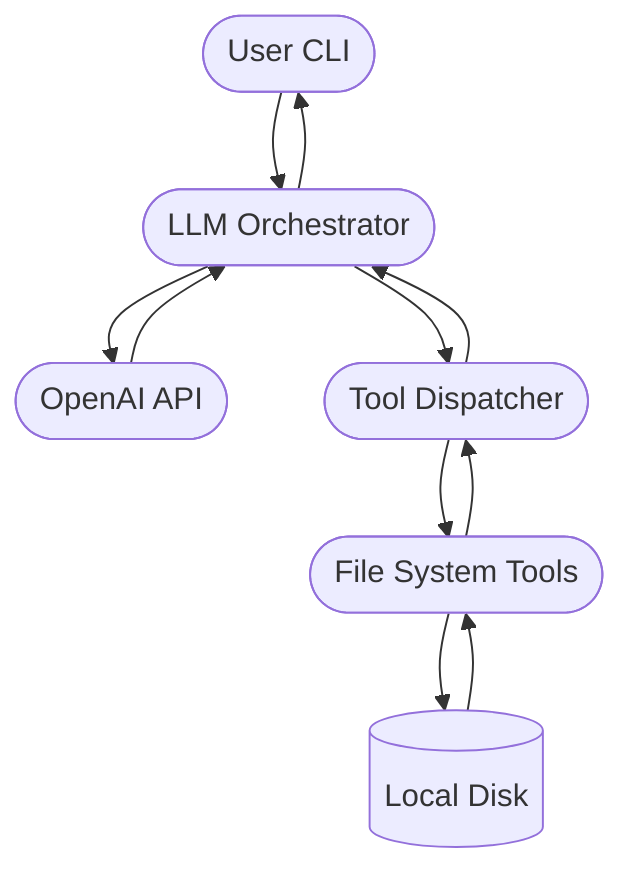
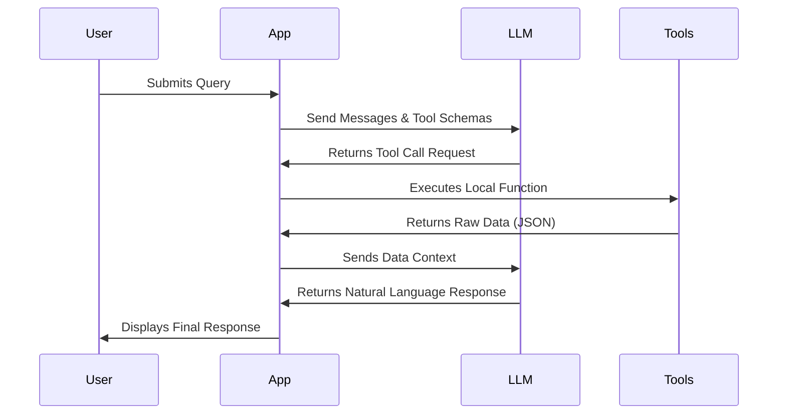

# System Architecture & Design

This document outlines the architecture, High-Level Design (HLD), and Low-Level Design (LLD) of the LLM-Powered File System Assistant.

## 1. Overview

The LLM-Powered File System Assistant is an interactive command-line application that bridges the gap between natural language processing and local file system operations. It leverages OpenAI's function calling capabilities to allow a Large Language Model (LLM) to autonomously decide when and how to interact with the local file system to answer user queries, such as parsing resumes, searching for keywords, and organizing files.

## 2. System Architecture

The architecture is composed of three primary layers:
1. **User Interface Layer:** The CLI interface where the user inputs natural language queries and receives responses.
2. **Orchestration Layer:** The core loop that manages the conversation history, communicates with the OpenAI API, parses the LLM's tool execution requests, and dispatches them to the appropriate local tools.
3. **Execution & File System Layer:** A set of modular, deterministic Python functions that execute file operations (read, write, list, search) on the local disk using native and third-party libraries.

### Architecture Diagram (Mermaid)

## 3. High-Level Design (HLD)

The High-Level Design focuses on the interaction flow when a user submits a query. 

### Interaction Flow
1. **Initialization:** The system loads environment variables and initializes the OpenAI client with a system prompt defining the assistant's persona and available tools.
2. **Query Submission:** The user inputs a query (e.g., "Find resumes mentioning Python").
3. **LLM Evaluation:** The orchestrator sends the conversation history and the JSON schema of available tools to the LLM.
4. **Tool Selection:** The LLM evaluates if a tool is needed. If yes, it returns a `tool_call` object instead of a direct text response.
5. **Tool Execution:** The orchestrator intercepts the `tool_call`, matches the requested function name to the local tool dispatcher, and executes the function with the LLM-provided arguments.
6. **Context Update:** The result of the local tool execution (JSON/Dictionary) is appended to the conversation history as a "tool" message.
7. **Final Synthesis:** The updated history is sent back to the LLM, which then synthesizes the raw data into a natural language response for the user.

## 4. Low-Level Design (LLD)

The Low-Level Design breaks down the internal modules, classes, and function signatures.

### Module 1: `llm_file_assistant.py` (The Orchestrator)

**Responsibilities:** Manages the OpenAI client, stores conversation history, defines tool schemas, and runs the chat loop.

**Key Components:**
*   **Pydantic Models (Schemas):** 
    *   `ReadFileArgs`, `ListFilesArgs`, `WriteFileArgs`, `SearchInFileArgs`
    *   *Purpose:* Used to auto-generate the JSON schema sent to OpenAI, ensuring the LLM returns strictly typed arguments.
*   **Class: `FileAssistant`**
    *   `__init__()`: Initializes the OpenAI client and the base system prompt.
    *   `execute_tool(tool_call) -> dict`: Takes the LLM's `tool_call` object, parses the JSON arguments, and maps it to the corresponding function in `fs_tools.py`.
    *   `chat(user_input: str) -> str`: The recursive loop. Sends input to the LLM, checks for `tool_calls`, triggers `execute_tool()`, appends results, and repeats until the LLM yields a final string response.

### Module 2: `fs_tools.py` (The Execution Layer)

**Responsibilities:** Directly interacts with the operating system and file system. Handles errors gracefully so the LLM doesn't crash the application.

**Key Functions:**
*   `read_file(filepath: str) -> dict`
    *   *Logic:* Validates file existence. Uses `pathlib` for metadata. Uses standard `open()` for `.txt`, `pypdf.PdfReader` for `.pdf`, and `docx.Document` for `.docx`.
    *   *Returns:* A dictionary with `status`, `content`, and `metadata`.
*   `list_files(directory: str, extension: str = None) -> list`
    *   *Logic:* Iterates through a directory using `pathlib.Path.iterdir()`. Filters by extension if provided.
    *   *Returns:* A list of dictionaries containing file metadata.
*   `write_file(filepath: str, content: str) -> dict`
    *   *Logic:* Creates parent directories via `mkdir(parents=True)`. Opens file in write mode.
    *   *Returns:* Success or error status dictionary.
*   `search_in_file(filepath: str, keyword: str) -> dict`
    *   *Logic:* Calls `read_file()` to get text. Splits text by newline. Iterates through lines doing a case-insensitive keyword check. Collects previous, current, and next line for context.
    *   *Returns:* Matches array with line numbers and context snippets.

### Error Handling Strategy
*   **Tool Level:** All functions in `fs_tools.py` use `try/except` blocks and return a standard `{"status": "error", "message": "..."}` dictionary on failure instead of raising exceptions.
*   **Orchestrator Level:** If a tool returns an error dictionary, it is passed back to the LLM. The LLM is instructed (via system prompt) to read the error and relay the problem to the user or attempt a fix autonomously.